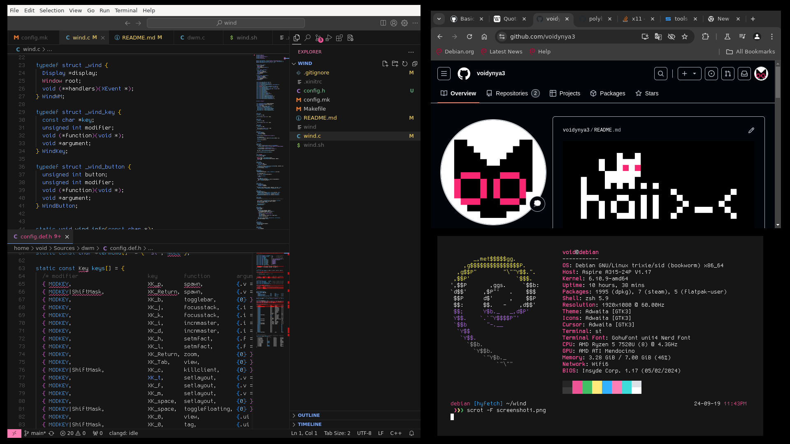

# wind 💨
an ordinary window manager. <sup>(based on [tinywm](https://github.com/mackstann/tinywm))</sup>

*<sup>(this is an experimental project, that we made to learn some stuff about Xlib.)</sup>*

## *"so... what is that?"*
***wind*** is a small window manager, that is also *kinda* usable.

***wind*** takes a **BIG** inspiration from:
+ [dwm](https://dwm.suckless.org/)
+ [OpenBox](https://openbox.org/)

## *"okay, how do i get it?"*
well, you need to follow these step... 
```
# 1. clone repository
git clone https://github.com/voidynya3/wind
cd wind

# 2. install some dependencies
sudo apt update
sudo apt install libX11-dev make gcc

# 3. and build it!
sudo make install
```
...and also you need to install [st](https://st.suckless.org/) and [dmenu](https://tools.suckless.org/dmenu/)!

## *"um... but why is that doesn't running?"*
so... you need to place `exec wind` to your `.xinitrc` file, and use `startx` to start it. here's an example of  `.xinitrc`:
```
#!/bin/sh

# place here your favorite programs, that you want to execute
# at the beginning of your session
polybar &
firefox &

# also, dont forget about 'wind'!
exec wind

# and here we go! :3
```
## *"well, how can i interact with it?"*
look, here some default keybindings that ***wind*** uses:
+ `Alt+D` - run dmenu
+ `Alt+Q` - close focused window
+ `Alt+Shift+Q` - quit wind
+ `Alt+LMB` - move focused window
+ `Alt+RMB` - resize focused window

## *"pretty interesting... but how can i configure it?"*
you can edit `config.h` file, to change some keybindings. (dont forget to rebuild wind using `sudo make clean install`)

## *"so... how does it looks like?"*
